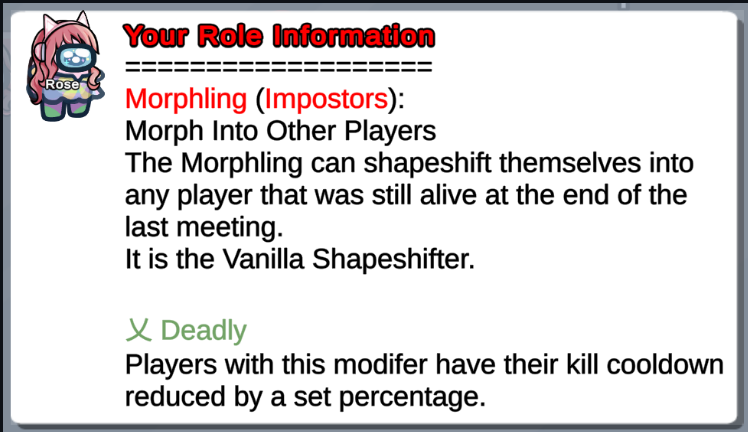

## Custom Tags

__Location__: `LOTUS_DATA/Titles'

__File Type__: yaml

__File Name__: Among Us Friend Code \(e.g. envykindly#7034)

Custom tags allow for players to add colors to their username as well as titles above their username in Among Us. In order for a host to add a players custom tag, they'll need to create a yaml file with any/all of the following information: 

```
UpperText:
 Text: # This is the text that goes above your username
 Gradient: # Creates a gradient FROM Color 1 to Color 2 automatically
 Size: # Default AU size is 2
  
Name: # This is the size and color/gradient attributed to your username. Leave this line blank and fill in the options below 
 Gradient: # Creates a gradient from Color 1 to Color 2 automatically. For gradient enter "[hex 1], [hex 2]" (refer to examples above)
 Size: # Default AU size is 2

Prefix: # This is the size, color, and text that goes before your username. Leave this line blank and fill in the options below
 Spaced: # This field is either True or False and used if there should be a space between the Suffix and the player's username (example: ♥ shiftyrose)
 Text: # Add the text you'd like to go before your username here   
 Color: # Add the hex code that you'd like the prefix to be here
 Size: # Default AU size is 2

Suffix: # This is the size, color, and text that goes after your username. Leave this line blank and fill in the options below
 Spaced: # This field is either True or False and used if there should be a space between the Suffix and the player's username (example: shiftyrose ♥)
 Text: # Add the text you'd like to go before your username here   
 Color: # Add the hex code that you'd like the prefix to be here
Size: # Default AU size is 2

LowerText:
 Text: # This is the text that goes below your username
 Gradient: # Creates a gradient FROM Color 1 to Color 2 automatically
 Size: # Default AU size is 2
```

__Creating A New Title__:

Navigate to the `/LOTUS_DATA/Titles` directory

Create a new yaml file named: `[friendcode].yaml` (example: `buffdulcet#0871.yaml`)

Set up the title components in the yaml


__Available Components__:

| Components | Description                                             |
|------------|---------------------------------------------------------|
| UpperText  | Responsible for the text above the player's username    |
| LowerText  | Responsible for the text below the player's username    |
| Prefix     | The text that comes before a player's username          |
| Suffix     | The text that comes after a player's username           |
| Name       | The player's username                                   |

*The player's username is the name they enter the lobby with or change with /name. It is not specified directly in the yaml file.*

__Component Items__: 

These are the things you can define for each component to change

| Item     | Description                                                                                                   |
|----------|---------------------------------------------------------------------------------------------------------------|
| Text     | Sets the text for the component (does not work for Name)                                                      |
| Gradient | A list of HTML color codes defining a range of colors to apply to the text. (Refer to the example image)      |
| Color    | If gradient is not specified, a solid color to apply to the text                                              |
| Size     | The size of the text (default is 2)                                                                           |
| Spaced   | (Only applicable to Prefix & Suffix) Whether the text should have a space between it and the player's name    |


Lastly you can reload your (local) title files with the command '/tload', the change is __immediate__

### Example Tags

#### Example 1
```yaml
UpperText:<br>
> Text: The One Above All<br>
> Gradient: "#ff0000, #e1e100" #Creates a gradient FROM Color 1 to Color 2 automatically<br>
> Size: 2 # Default AU size is 2, i believe this is exponential (so 100 would be terrible)<br>
  
Name:<br>
> Gradient: "#e1e100, #ff0000" #Creates a gradient FROM Color 1 to Color 2 automatically<br>
> Size: 2 # Default AU size is 2, i believe this is exponential (so 100 would be terrible)<br>

Prefix:<br>
> Spaced: True # If there should be a space between the Suffix and the player's name (example: Akali ♥)<br>
> Text: ∞    <br>
> Color: "#ff0000"<br>
> Size: 2 # Default AU size is 2, i believe this is exponential (so 100 would be terrible)<br>

Suffix:<br>
> Spaced: True # If there should be a space between the Suffix and the player's name (example: Akali ♥)<br>
> Text: ∞    <br>
> Color: "#e1e100"<br>
> Size: 2 # Default AU size is 2, i believe this is exponential (so 100 would be terrible)<br>
```
  
__Output__:



#### Example 2
```yaml
Name:<br>
> Gradient: "#3BCFD4, #FC9305, #F20094"

UpperText:<br>
> Size: 1.925<br>
> Text: ♡ Tipsy ♡<br>
> Gradient: "#3BCFD4,#F20094, #F74B4B, #FC9305,#96B373, #3BCFD4,#F20094"<br>

Prefix:<br>
> Text: ♥<bR>
> Spaced: true<br>
> Color: "#F20094"<br>

Suffix:<br>
> Text: ♥<br>
> Spaced: true<br>
> Color: "#3BCFD4"<br>
```
__Output__:
