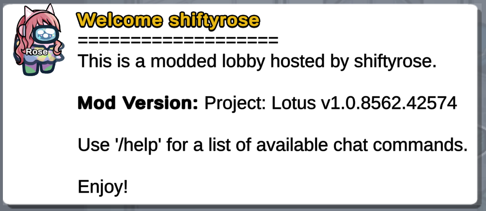
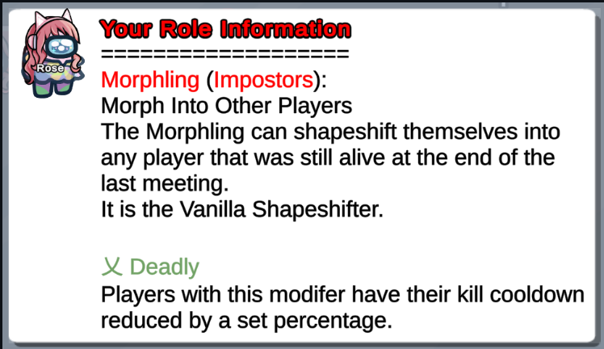

__Location__: `LOTUS_DATA/Templates.yaml`

__Chat Command__: /t _or_ /template _or_ /templates [tag]

Templates allow you to send pre-written and frequently used blocks of text in chat. They offer endless possibilities and are commonly used for various purposes, such as welcome messages, rules, first meeting messages, and commonly used statements.

To access your saved templates, you or another player can type /t [tag] (e.g. /t rules). If the host types the message, the tag will be hidden (so no one will know you are using it to show messages), but the text will be shown to everyone. If a player types the same command, the tag will show for everyone, but the message will be shown privately (only to the player).


## Templates

### Command Guide

This table serves as a quick reference for the different commands you can use with the template system. The host can use tags to customize the lobby and help players understand the game.

| Command                      | Alias                 | Description                                                    |
| ---------------------------- | --------------------- | -------------------------------------------------------------- |
| `/t list`                    | `/t l`                | Lists all templates by ID (and their tags)                     |
| `/t tags`                    |                       | Shows all tags built into the mod                              |
| `/t variables`               | `/t v`                | Shows all variables that can be used in templates              |
| `/t reload`                  |                       | Reloads all templates                                          |
| `/t [tag]`                   | `/[alias]`            | Shows template to all players                                  |
| `RShift`+`/t [tag]`          | `RShift`+`/[alias]`   | Shows template to dead players                                 |

### Tag Customization 

Project Lotus has a number of built-in tags. These tags will automatically be displayed when certain lobby/meeting events happen. These are optional, but allow you to further customize your lobby.

| Tag                |  Description                                                                                                                                                                                |
| ------------------ | ------------------------------------------------------------------------------------------------------------------------------------------------------------------------------------------- |
| lobby-join         | Tag for the template shown to players joining the lobby.                                                                                                                                    |
| autostart          | Template triggered when the autostart timer begins.                                                                                                                                         |
| meeting-first      | The template to show during the first meeting.                                                                                                                                              |
| meeting-subsequent | The template to show during all meetings after the first.                                                                                                                                   |
| meeting-start      | The template to show during each meeting.                                                                                                                                                   |

## Usable Variables

This table serves as a quick reference for the different variables that can be utilized in templates.

| Name                  | Variable                  | Output                                                                                              |
| --------------------- | ------------------------- | --------------------------------------------------------------------------------------------------- |
| All Modifiers         | $\{AllModifiers}           | A list of all modifiers in the mod                                                                  |
| All Roles             | $\{AllRoles}               | A categorized list of all roles in the mod                                                          |
| Alive Crewmate Count  | $\{AliveCrewmateCount}     | A count of all alive crewmates                                                                      |
| Alive Impostor Count  | $\{AliveImpostorCount}     | A count of all alive impostors                                                                      |
| Alive Neutrals Count  | $\{AliveNeutralsCount}     | A count of all alive neutrals                                                                       |
| Alive Player Count    | $\{AlivePlayerCount}       | A count of all alive players                                                                        |
| Alive Players         | $\{AlivePlayers}           | All alive player names, separated by comma                                                          |
| AU Version            | $\{AUVersion}              | The current version of Among Us                                                                     |
| Blurb                 | $\{Blurb}                  | The player's role blurb                                                                             |
| Color                 | $\{Color}                  | The color of the player's avatar                                                                    |
| Crewmate Count        | $\{CrewmateCount}          | A count of all crewmates                                                                            |
| Crewmates             | $\{Crewmates}              | All crewmate names, separated by comma                                                              |
| Date                  | $\{Date}                   | The current date (based on host)                                                                    |
| Dead Players          | $\{DeadPlayers}            | All dead player names, separated by comma                                                           |
| Dead Player Count     | $\{DeadPlayerCount}        | A count of all dead players                                                                         |
| Death                 | $\{Death}                  | A player's CoD                                                                                      |
| Description           | $\{Description}            | The player's role description                                                                       |
| Faction               | $\{Faction}                | The player's faction                                                                                |
| Game Mode             | $\{Gamemode}               | The current game mode selected                                                                      |
| Host                  | $\{Host}                   | The host's name                                                                                     |
| ImpostorCount         | $\{ImpostorCount}          | A count of all impostors                                                                            |
| Impostors             | $\{Impostors}              | All impostor names, separated by comma                                                              |
| Killer                | $\{Killer}                 | A player's killer                                                                                   |
| Level                 | $\{Level}                  | A player's level                                                                                    |
| Map                   | $\{Map}                    | The name of the last map selected                                                                   |
| Mod Name              | $\{ModName}                | The current mod name                                                                                |
| Mod Version           | $\{ModVersion}             | The current mod version                                                                             |
| Modifiers             | $\{Modifiers}              | Shows the player's modifiers as a list of names                                                     |
| Mods Descriptive      | $\{ModsDescriptive}        | Displays the description for each of a player's modifiers                                           |
| My Role               | $\{MyRole}                 | Echoes the text of /myrole which shows the player's role and role description.                      |
| Name                  | $\{Name}                   | The player's name                                                                                   |
| NeutralKillers        | $\{NeutralKillers}         | All neutral killer names, separated by comma                                                        |
| NeutralKillersCount   | $\{NeutralKillersCount}    | A count of all neutral killers                                                                      |
| Neutrals              | $\{Neutrals}               | All neutral names, separated by comma                                                               |
| NeutralsCount         | $\{NeutralsCount}          | A count of all neutrals                                                                             |
| Option Name           | `${OptionName.[Name]}`      | Shows the NAME of an option (as in current lang)                                                    |
| Options               | $\{Options}                | The player's role options                                                                           |
| Player Count          | $\{PlayerCount}            | A count of all players currently in lobby                                                           |
| Players               | $\{Players}                | A list of player names separated by a comma                                                         |
| Role                  | $\{Role}                   | The player's role                                                                                   |
| Room Code             | $\{RoomCode}               | The current room code                                                                               |
| Tasks Complete        | $\{TasksComplete}          | The # of tasks a player has completed                                                               |
| Tasks Remaining       | $\{TasksRemaining}         | The # of tasks a player has remaining                                                               |
| Time                  | $\{Time}                   | The current time (based on host)                                                                    |
| Total Tasks           | $\{TotalTasks}             | A player's total # of tasks                                                                         |
| Trigger Meta          | $\{TriggerMeta}            | This variable resolves differently based on the trigger the template is invoked from                |


## Template Customization

There are endless possibilities when it comes to template customization in Project: Lotus. Not only are all the variables above usable in any templates created by the host, hosts can also use HTML and symbols to customize their templates even further. 

Here are some basic tools to get you started:

### Usable HTML Tags 

| HTML Tag       | Description                                            |
| -------------- | ------------------------------------------------------ |
| `<b>`          | Bold text                                              |
| `<i>`          | Italicized text                                        |
| `<u>`          | Underlined text                                        |
| `<s>`          | Strikethrough text                                     |
| `<sub>`        | Subscript text                                         |
| `<sup>`        | Superscript text                                       |
| `<mark>`       | Highlighted or marked text                             |
| `<size= >`     | Size of text (Default AU size is 2)                    |
| `<color= >`    | Color of the text (use hex code)                       |


### Usable Unicode Symbols

乂 ⁂ ¤ § ∮ 彡 个 《 「 」 人 요 〖 〗 ロ 米 卄 王 ī l 【 】 · ㅇ ° ◈ ◆ ◇ ◥ ◤ ◢ ◣ 《 》 ︵︶ ★ ☆ ☀ ☂ ☹ ☺ ♥ ♡ ♩ ♪ ♫ ♬ ✓ ♠  ☎ ♀ ♂ ☜ ☝ ☞ ☟ ☯ ☃ ✿ ❀ ☁ ¿ ※ ⁑ ∞ ≠ + ÷ º

### Blank Template

```
Templates:
- Tag:
  Aliases: []
  Title:
  Text:
```

## Default Template 

```
Templates: #This is necessary for the file, do not remove this line!


- Tag: lobby-join #Notice that there is a hyphen (-) before the Tag, it is necessary when creating new tags. This is the text entered after '/t'
  Aliases: [welcome] #Aliases can be used to create custom commands (i.e. no need for '/t'). This Alias allows for '/welcome' to generate the same response as '/t lobby-join'
  Title: <color=#e9b915>Welcome ${Name}</color> #This is the text that will appear in place of the host's name at the top of the message in chat. 
  Text: | #This pipe (|) allows for conditional formatting (line breaks can easily be attained by pressing enter). Each line MUST have one space indented from the 'Text:' column
   ===================
   This is a modded lobby hosted by ${Host}. 

   <b>Mod Version:</b> Project: Lotus v${ModVersion}

   Use '/help' for a list of available chat commands.

   Enjoy!


- Tag: rules
  Aliases: [rules]
  Title: Lobby Rules
  Text: #Fill this in with your lobby rules. Some examples for this could be 'do not claim roles unless you have important info' or 'saying start results in auto-kick' 


- Tag: meeting-first
  Title: Your Role Information
  Text: |
    ===================
    ${Role} (${Faction}):
    ${Blurb}
    ${Description}

    ${ModsDescriptive}


- Tag: meeting-start
  Title: Helpful Commands
  Text: |
   =================
    /m → show your role & modifier description
    /o → view your role and modifier options
    /r [role] → other roles' description & options
    /desc → first meeting message
    /help → list of helpful commands
```

------------------------------------------------------------------------------------------------------------------------------------------------------------------------------------------
## Misc.
#### Default lobby-join Template


#### Default meeting-first Template


#### Default meeting-start Template


#### Useful Templates Not Included With Defaults

##### Nicer meeting-first Template
```
- Tag: meeting-first
  Title: "${Role} (${Faction})\n<sup>Modifiers: ${Modifiers}"
  Text: |
   \n================
  
   You are the ${Role}

   ${Description}

   ${ModsDescriptive}
```

### Helpful Alchemist Templates
```
- Tag: ai
  Aliases: [ai]
  Title: Alchemist Ingredient List
  Text: |
   ------------------------------------------------------
    <color=#89a0a0>◆ = Catalyst</color> (Source: Completing Tasks)
    <color=#d15914>Θ = Theta Rift</color> (Source: Random Spawn)
    <color=#96c185>⚠ = Vial of Decay</color> (Source: Dead Bodies)
    <color=#ffaced>❀ = Shifting Rose</color> (Source: Shapeshifters)
    <color=#8c28bc>☀ = Essence of Sight</color> (Source: Fixing Lights)
    <color=#72ff75>◯ = Fragment of Discussions</color> (Source: Groups of 3 or more people)
- Tag: ap
  Aliases: [ap]
  Title: Alchemist Potions:
  Text: |
   ------------------------------------------------------
    <color=#96c15b>Potion of Death</color>:
    Kills the nearest player

    <color=#d4d45e>Castling Brew</color>:
    Applies a 1-time use shield to the player

    <color=#9900ff>Potion of Sight</color>:
    Increases players vision for 60 seconds OR removes sabotage vision

    <color=#ff389b>Warp Potion</color>
    Teleports you and a random player

    <color=#0000ff>Mechanic's Mix</color>:
    Allows player to instant fix next sabotage

    <color=#6a8759>Leader Potion</color>:
    Gives +1 vote during the next meeting

    <color=#FFEDF9>S</color><color=#FFE4F4>e</color><color=#FFDCEE>r</color><color=#FFD4E8>e</color><color=#FFCBE2>n</color><color=#FFC3DC>e</color><color=#FFBBD7> </color><color=#FFB2D1>G</color><color=#FFAACB>r</color><color=#FFA2C5>a</color><color=#FF99BF>c</color><color=#FF91BA>e</color>: 
    Reveals the role of the most nearby player

    <color=#FF0000>U</color><color=#FF2A00>n</color><color=#FF5500>s</color><color=#FF7F00>t</color><color=#FFA301>a</color><color=#FFC702>b</color><color=#FFEB04>l</color><color=#AAF102>e</color><color=#55F801> </color><color=#00FF00>C</color><color=#00D455>o</color><color=#00AAA9>n</color><color=#007FFF>c</color><color=#0055FF>o</color><color=#002AFF>c</color><color=#0000FF>t</color><color=#2A00FF>i</color><color=#5400FF>o</color><color=#7F00FF>n</color>:
    Mutates into a random potion"
- Tag: api
  Aliases: [api]
  Title: Alchemist Potion Ingredients
  Text: |
   ------------------------------------------------------
    <color=#96c15b>Potion of Death</color>: <color=#96c185>
    ⚠ Vial of Decay</color> + <color=#89a0a0>◆ Base Catalyst Amount</color>
    
    <color=#d4d45e>Castling Brew</color>:
    <color=#89a0a0>(2) ◆ Catalyst</color> +  <color=#89a0a0>◆ Base Catalyst Amount</color>
    
    </color=#9900ff>Potion of Sight</color>:
    <color=#8c28bc>☀ = Essence of Sight</color> + <color=#89a0a0>◆ Base Catalyst Amount</color>
     
    <color=#ff389b>Warp Potion</color>:
    <color=#d15914>Θ = Theta Rift</color> + <color=#89a0a0>◆ Base Catalyst Amount</color>
     
    <color=#0000ff>Mechanic's Mix</color>:
    <color=#72ff75>◯ = Fragment of Discussions</color> + <color=#89a0a0>◆ Base Catalyst Amount</color>
    
    <color=#6a8759>Leader Potion</color>:
    <color=#72ff75>◯ = Fragment of Discussions</color> + <color=#89a0a0>◆ Base Catalyst Amount</color>
    
    <color=#FFEDF9>S</color><color=#FFE4F4>e</color><color=#FFDCEE>r</color><color=#FFD4E8>e</color><color=#FFCBE2>n</color><color=#FFC3DC>e</color><color=#FFBBD7> </color><color=#FFB2D1>G</color><color=#FFAACB>r</color><color=#FFA2C5>a</color><color=#FF99BF>c</color><color=#FF91BA>e</color>:
    <color=#ffaced>(2) ❀ Shifting Rose</color> + <color=#89a0a0>◆ Base Catalyst Amount</color>
    
    <color=#FF0000>U</color><color=#FF2A00>n</color><color=#FF5500>s</color><color=#FF7F00>t</color><color=#FFA301>a</color><color=#FFC702>b</color><color=#FFEB04>l</color><color=#AAF102>e</color><color=#55F801> </color><color=#00FF00>C</color><color=#00D455>o</color><color=#00AAA9>n</color><color=#007FFF>c</color><color=#0055FF>o</color><color=#002AFF>c</color><color=#0000FF>t</color><color=#2A00FF>i</color><color=#5400FF>o</color><color=#7F00FF>n</color>:
    <color=#d15914>(2) Θ Theta Rift</color> + <color=#89a0a0>◆ Base Catalyst Amount</color>
```

### Note On Template Creation
- The hyphen (-) is required
- The colon and space after it are required 
- The indentation of the word Text (aligning with the indentation of the word Tag) is required 
- You must capitalize Tag and Text (and any other parameter used in Template.yaml)